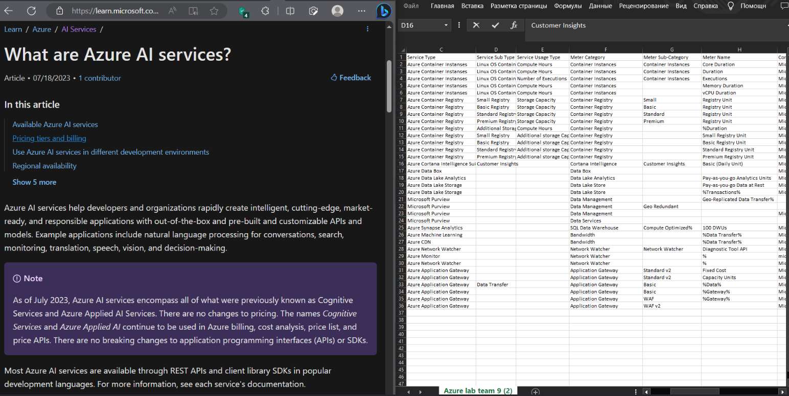
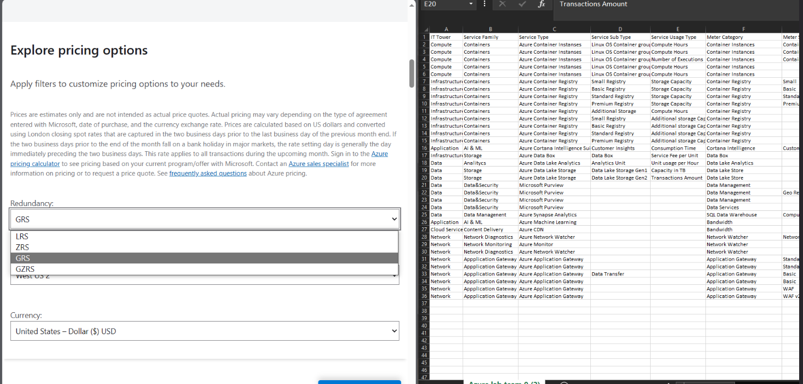
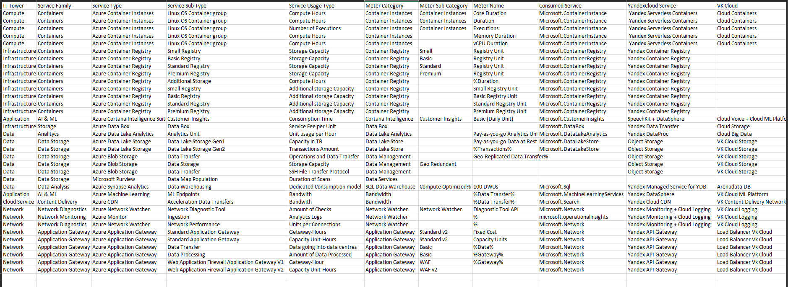

# Аналитическая лабораторная работа по облачным технологиям

*Цель работы:* узнать о назначении различных облачных сервисов, проанализировать фичи, то, за что проходит оплата каждого из них, понять, к какому уровню абстракции относится каждый, исходя из этих знаний найти аналоги среди российских сервисов.

*Дано:* 
1. Слепок данных биллинга от провайдера
2. Google с документациями провайдера

*Процесс:*

 Сепок данных биллинга провайдера был проанализирован, после чего была изучена документация Microsoft Azure по указанным в .csv сервисам. Затем изучен официальный яндексовский маппинг инструментов Azure на Yandex Cloud. 

Очень многих сервисов, указанных в лабораторной, не оказалось, поэтому была досконально изучена (это весьма изнурительно) вся экосистема Yandex Cloud и VK Cloud. В некоторых случаях, у сервисов Microsoft более широкий функционал, чем у российских аналогов (и наоборот), поэтому иногода писала <service name> + <service name>, чтобы наиболее точно и без потерь импортозаместить инструменты. Azure DataBox вообще почти уникален, ибо он позволяет пользователям переносить большие объемы данных в облако Azure, не используя сеть интернет, чего нет у Яндекса и ВК, поэтому замещение не полное.

Для заполнения таблицы, сначала все сервисы были расположены в порядке IT Tower от сетевого уровня к уровню приложений {Networking, Infrastructure, Security, Cloud Service, Compute, Data, Application}. Затем заполнила категорию сервиса, полное название сервиса, что облагается оплатой, и за что именно списали деньги.

# ***Описание сервисов Azure и российских аналогов (Yandex Cloud и VK Cloud)***
------ 
__Azure Container Instances__ это CaaS сервис, предоставляющий быстрый запуск контейнеров (как Linux, так и Windows) в облаке, возможность развёртывания без использования виртуальных машин или средств для оркестрации контейнеров. Управлять контейнерами можно через командную строку. Имеется поддержка докерхабовских (и из других известных реестров) докер-образов, а также возможность постоянного хранения данных путем монтирования файловых ресурсов Azure в контейнер. В целом, в отличие от AKS, ACI подходит для кратковременных нагрузок, которые работают не перманентно, а с частыми запусками и остановками. ACI имеет возможность настройки для доступа к ресурсам виртуальной сети с помощью Virtual Network peering.

__Yandex Serverless Containers__ также предоставляет пользователям возможность запускать контейнеры, не управляя серверами и инфраструктурой. Масштабирование приложений автоматическое, оплата происходит только по факту времени использования ресурсов или количеству запусков контейнеров. Также можно сделать возможным допуск контейнера к пользовательским ресурсам в указанной сети, не только из интернета. Из особенностей можно указать поддержку экземпляров контейнеров без холодного старта, что даёт высокую скорость при запуске.

__Cloud Containers (VK)__ схож с Yandex Serverless Containers в плане возможности автоматического масштабирования и оплатой по факту использования ресурсов, без разделения на Standart/Premium. Однако, в отличие от двух предыдущих опций, VK предлагает работу только с Kubernetes. Из преимуществ - много метрик: Графики по ключевым метрикам кластера (Cloud Monitoring), монитлринг доступности, аудит прав доступа, управление защитой и тд.

---
__Azure Container Registry__ является облачной службой реестра контейнеров, хранящая и управляющая докер образами. Этот сервис не предоставляет пользовательский интерфейс и извлекать образы можно только через командную строку.

__Yandex Container Registry__ как и ACR, предоставляет безопасное место для хранения Docker-образов, реестров, репозиториев и volumes (инструмент для постоянного хранения на экземпляре ВМ) в облаке и взаимодействия с ними. Помогает разработчикам и DevOps-инженерам развёртывать и управлять контейнеризованными приложениями, которые достаточно просто мейнтейнить. Есть поддержка и консоли, и CLI, и API, и стандартной CLI докера.

__VK Cloud__ у них я не обнаружила ускоспециализированного сервиса, только широкопрофильный сервис для облачного оркестратора.

---
__Azure Cortana Intelligence Suite__ это сервис, предоставляющий широкий спектр возможностей для анализа данных и искусственного интеллекта, среди которых: Power BI (для визуализации данных), HDInsight Spark (Apache Spark в облаке), инструменты для создания и развёртывания масштабныхмоделей машинного обучения на суперкомпьютерах, деплоя приложений с ИИ, возможность использования ВМ, оптимизированных для искуственного интеллекта. А также, как следует из названия, интеграцию с персональным ассистентом Cortana. Среди Service Sub Types есть Information Management, Big Data Stores (для озёр данных и DWH), Dashboards and Visualization (Power BI, так как это Майкрософт), Machine Learning and Analytics (туда входит сервис для Hadoop), Intelligence (сам голосовой помощник). Также последний подсервис предоставляет инструменты для разработки ботов - Bot Framework (и, что, на мой взглядсамое полезное - Language Understanding Intelligent Service (LUIS), чтобы разбирать намерения пользователя и извлекать сущности из естественного языка.).

__SpeechKit + DataSphere__ - это два сервиса, которыми в сумме можно импортозаместить сервис от Azure. Первый создаёт голосовых ассистентов с реалистичным голосом, распознаванием речи и аналитикой клиентов для автоматизации бизнесов. DataSphere же предоставляет инструменты для всего ML пайплайна: от подготовки данных, виртуального окружения и библиотек до предоставления вычислительных мощностей для обучения моделей.

__Cloud Voice + Cloud ML Platform__ первая платформа предназначена для автораспознавания и синтеза речи, имитирующей естесственную. Работает стабильно, ибо у VK есть стабильный и хорошо звучащий голосовой ассистент Маруся. Работает и с потоком аудио, и с отдельными звуковыми файлами, то есть можно использовать и для поддержки, коллцентра, и для озвучки контента. Также присутствует аналитика клиентской обратной связи. Cloud ML Platform предоставляет услуги от GPU для ML, либ, трекинга экспериментов для обучения, до деплоя и обновления моделей, которые уже в продакшене.

---
__Azure Data Box__ позволяет клиентам относительно быстро и очень безопасно (с AES шифрованием) транспортировать большое количество данных в облако без сети интернет, используя протоколы NAS (сервер для хранения данных на уровне файлов).

__Yandex Data Transfer__ это платформа для миграции данных. Хотя больше этот сервис является аналогом Azure Database Migration Service, частично им можно заменить и Data Box, ведь перенести большие данные можно так же надёжно и с минимальным временем простоя, да ещё, в отличие от Azure сервиса, позволяет поставлять данные в Кликхаус для аналитики.

__Cloud Storage__ совсем не является аналгом майкрософтоскому сервису, ибо BK Cloud Storage скорее представляет собой облачное хранилище данных, нежели службу для их физической пересылки.

---
__Azure Data Lake Analytics__ это служба для анализа больших данных (и структурированных, и неструктурированных, обычно в виде BLOB-ов), позволяющая запускать параллельные задачи аналитики. Из преимуществ - масштабируемость вычислительных мощностей, отсутствие небходимости менеджмента инфраструктуры (из-за отсутствия серверов и кластеров, требующих настройки), оптимизация, возможность виртуализировать аналитику. Запросы к озеру данных и анализ можно выполнять посредством U-SQL (комбинация декларативности SQL и императивностью C#).

__Yandex DataProc__ является сервисом для обработки большого объёма данных, работающий в связке с Hadoop, Spark, и других систем для ETL и других видов data processing. Отлично работает с Yandex Object Storage buckets, откуда можно брать хранимые данные, подготавливать и очищать их, чтобы затем создавать витрины данных. Также инструмент представляет возможность обрабатывать потоки данных в реальном времени.

__Cloud Big Data__ очень широкопрофильное решение не только для озёр данных, но включает в себя Apache Hadoop, который поддерживает анализ озёр данных.

---
__Azure Data Lake Store__ представляет собой масштабируемое безопасное хранение данных, специально оптимизированное под его последующий анализ. В новой версии есть совместимость со всеми платформами, использующими Apache Hadoop (распределённую файловую систему).

__Yandex Object Storage__ подходит для хранения больших объёмов данных, в том числе в виде блобов, обеспечивая высокую доступность и надёжность. Есть автоматическое увеличение хранилища с ростом объёма данных. Присутствует поддержка Apache Airflow (для оркестрации пайплайнов анализа данных) из коробки.

__VK Cloud Storage__ это очень широкопрофильное решение для хранение почти любых видов данных, среди которых большие (Data Lakes, Data mining). Из преимуществ можно указать совместимость с CLI, Java SDK, API, возможность хранения логов и автоматическое увеличение хранилища с ростом объёма данных.

---
__Microsoft Purview__ это централизованный сервис по управлению данными как в локальных, так и в облачных средах. Можнополучить аналитику, глоссарий с техническими терминами для поиска, единую схему связей между данными, автоматизировать получение метаданных, сведений о состоянии операций над данными.

---
__SQL DW__ (ныне __Azure Synapse Analytics__) - представляет собой объединенную аналитическую платформу, разработанную для обработки, анализа и визуализации масштабных датасетов в облачной среде. Она объединяет в себе преимущества больших данных и исследовательских возможностей для создания комплексных аналитических решений. Эта платформа предоставляет инструменты для разработки и оркестровки данных, обеспечивая гибкость и масштабируемость для аналитических проектов.

__Yandex Managed Service for YDB__  является управляемой базой данных, предоставляющая гибкие возможности для обработки и анализа данных с использованием SQL и NoSQL методов (на YSQL). Также предоставляет услуги корпоративного хранения данных из разных источников с помощью CDC и ETL.

__Arenadata DB__ аналитическая БД, являющаяся кластерным сервисом, развёртывабщая базу для хранения и обработки больших данных в облаке. Она может быть даже основой для неструктурированных данных (Data Lakes) и отлично интегрируется с сервисами анализа больших данных.

---
__Azure Machine Learning__ предлагает автоматизированный выбор моделей и настроек, что упрощает и ускоряет процесс разработки моделей. Сервис поддерживает такие ЯПы и либы, как Python, R, TensorFlow и PyTorch и предлагает серьёзный уровень защиты данных и высокую производительность вычисллений, а также визуализации данных.

__Yandex DataSphere__ это многофункциональная платформа, предназначенная для специалистов в области данных и разработчиков, позволяющая эффективно осуществлять разработку, анализ и внедрение данных и моделей машинного обучения в удобной облачной среде. Из особенностей - предоставляется пользовательский интерфейс для работы с данными.

__VK Cloud ML Platform__ это среда, базирующаяся на облаке, которая обеспечивает необходимые ресурсы и инструментарий для создания продвинутых решений на базе машинного обучения. Платформа предназначена для облегчения интеграции и внедрения этих моделей в приложения и системы. Из особенностей здесь есть инструмент для командной разработки и планирования задач и хранение реализовано в российских ЦОДах.

---
__Azure CDN__ это распределённая инфраструктура для быстрой доставки контента пользователям сайтов, в каком регионе они бы не находились (так как серверы расположены по равномерно по миру). Поддерживается масштабирование без простоев. Присутствует встроенная поддержка HTTPS для доменов и защита от DDoS.

__Yandex Cloud CDN__ представляет схожий с азуровским функционал. Точно так же с помощью распределения и кэширования происходит снижение нагрузки на основной сервер (ориджин). Всего CDN-ов более 140. Также Яндекс предоставляет инструменты аналитики трафика и запросов.

__VK Content Delivery Network__ суть та же, что и в первых двух сервисах. Основной сервер разгружен, а CDN принимвют на себя весь трафик. Производитель заявляет среднюю задержку в 20 мс и более 400 ЦОДов на 5 континентах.

--- 
__Azure Network Watcher__ разработан для обеспечения мониторинга и управления сетевыми элементами в Azure. В нём есть инструменты анализа сетевого состояния, трафика, диагностики и отладки сети.

__Yandex Monitoring + Cloud Logging__ ближайшим аналогом может считаться Yandex Monitoring, который также позволяет следить за состоянием и производительностью ресурсов в реальном времени, а также настраивать собирание и анализ логов. Также в Yandex Cloud есть сервис Cloud Logging для работы с логами.
__VK Cloud Logging__ служит для сбора, анализа, и хранения данных о событиях. Он обеспечивает быстрый поиск и визуализацию данных, что делает его инструментом выбора для мониторинга приложений и системы.

---
__Azure Application Gateway__ многофункциональнфй инструмент, который обеспечивает управление трафиком к веб-приложениям. Поддерживает такие функции, как защита приложений от угроз, маршрутизация на уровне приложения (Layer 7), SSL завершение (для снижения нагрузки с серверов), и управление сессиями.
__Yandex API Gateway__ имеет крайне схожие фичи с сервисом-аналогом от Microsoft, но, в отличие от него, с помощью яндексовского сервиса можно создавать API-шлюзы (это компонент ПО, связь между внешними приложениями и внутренними ресурсами компании).

__Load Balancer Vk Cloud__ имеет немного более узкоспециализированный функционалб чем у двух предыдущих: это чисто отказоустойчивый веб-трафиковый балансировщик с автомасштабированием. Также имеет платформу для анализа статистики, чтобы своевременно решать проблемы. Для определения оптимального сервера для каждого входящего запроса используются продвинутые алгоритмы.

